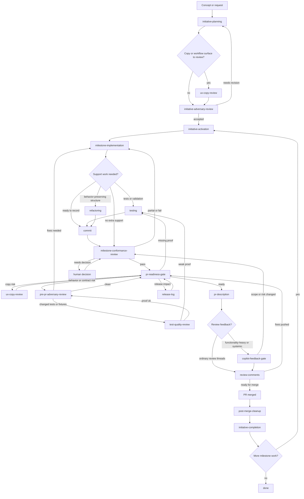

# Codex Skills

Custom global Codex skills for agent-first initiative work.

Use the lifecycle for initiative-sized changes. For small fixes, use only the
skills proportional to risk.

## Start Here

Ask for the phase or outcome you want:

- "Plan an initiative for this idea."
- "Review this copy or workflow for first-time user clarity."
- "Review this initiative before activation."
- "Activate this initiative and prepare the first milestone."
- "Implement the current milestone."
- "Run conformance review."
- "Prepare the PR."
- "Handle PR feedback."
- "Finish post-merge cleanup."

Individual skills can still be named directly when you want exact control.

## Initiative Workflow

```text
concept
  -> initiative-planning
  -> ux-copy-review
  -> initiative-adversary-review
  -> initiative-activation
  -> milestone-implementation
  -> milestone-conformance-review
  -> pr-readiness-gate
     (routes to ux-copy-review / pre-pr-adversary-review / release-log / pr-description as needed)
  -> copilot-feedback-gate / review-comments
  -> post-merge-cleanup
  -> initiative-completion
  -> next milestone or done
```

This graph shows the default initiative route. For small changes, enter at the
skill that matches the current phase and let `pr-readiness-gate` route PR prep.



## Agent Roles

| Role | Agent | Context | Skills |
| --- | --- | --- | --- |
| Orchestrator | Main agent | Full conversation | Chooses next step, integrates results, owns decisions |
| Initiative planner | Main agent | Full or focused | `initiative-planning` |
| UX copy reviewer | Main agent or delegated reviewer | Full or focused | `ux-copy-review` |
| Planning adversary | `adversarial-reviewer` | Clean | `initiative-adversary-review` |
| Activator | Main agent | Main | `initiative-activation` |
| Builder | `builder` | Clean packet-only | `milestone-implementation`, `testing`, `refactoring`, `commit` |
| Conformance auditor | `conformance-auditor` | Clean | `milestone-conformance-review` |
| Implementation adversary | `adversarial-reviewer` | Clean | `pre-pr-adversary-review`, `code-review` |
| PR publisher | Main agent | Main | `pr-description`, `release-log`, `commit` |
| Readiness gate | `light-gate` | Clean or focused | `pr-readiness-gate`, `copilot-feedback-gate` |
| Review responder | Main agent | Main | `review-comments`, `testing`, `commit` |
| Completion agent | Main agent | Main | `post-merge-cleanup`, `initiative-completion` |

## Clean Context

Use clean spawned agents when private conversation history would bias the result.

Best clean-context candidates:

- `ux-copy-review` when prior implementation context may bias the review
- `initiative-adversary-review`
- `milestone-implementation`
- `milestone-conformance-review`
- `pre-pr-adversary-review`
- `code-review`
- `copilot-feedback-gate`

Usually keep stateful/action workflows in the main context:

- `initiative-planning`
- `initiative-activation`
- `pr-description`
- `release-log`
- `review-comments`
- `post-merge-cleanup`
- `initiative-completion`

## Execution Profiles

Inherit the parent model by default. Delegate to a named custom agent when the
workflow benefits from clean context or a specific model/reasoning tier.

Invoking a skill that has a `Delegation Default` is an explicit request to use
that skill's named custom agent when a multi-agent spawn tool and the named
agent are available. Do not run those workflows locally merely because the user
did not separately say "use a subagent." If spawning or the named agent is not
available, run the workflow in the current context and state that delegation was
unavailable.

Custom agent source files live in `agents/` and should be installed to
`~/.codex/agents/` for Codex to load them.

| Agent | Model | Reasoning | Use |
| --- | --- | --- | --- |
| `light-gate` | `gpt-5.4-mini` | low | Quick readiness, existence, and routing checks |
| `builder` | `gpt-5.5` | medium | Focused implementation, tests, commits, and refactors |
| `conformance-auditor` | `gpt-5.5` | high | Milestone acceptance and evidence review |
| `adversarial-reviewer` | `gpt-5.5` | xhigh | Deep bug, contract, edge-case, and review-risk analysis |

## Durable Artifacts

Treat durable artifacts as the source of truth:

- initiative PRD, milestones, and optional architecture notes
- implementation packet and implementation report
- branch diff against `main`
- conformance report and adversarial review findings
- PR description, release notes, review comments, and completion report

If a justification matters, put it in an artifact: PRD, milestone,
architecture note, code comment, test, commit message, PR description, or review
reply.

## Path Notation

Use `SKILLS_DIR=/Users/hanna/.codex/skills` as the base path for helper scripts
and references in these docs. If a command or note uses `$SKILLS_DIR`, expand it
to that directory before executing the command unless the shell environment
already defines it.

## Skill Groups

Planning and lifecycle:

- `initiative-planning`
- `ux-copy-review`
- `initiative-adversary-review`
- `initiative-activation`
- `milestone-implementation`
- `milestone-conformance-review`
- `initiative-completion`

Implementation support:

- `testing`
- `refactoring`
- `commit`

Review and PR:

- `ux-copy-review`
- `pre-pr-adversary-review`
- `code-review`
- `pr-description`
- `release-log`
- `copilot-feedback-gate`
- `review-comments`

Post-merge:

- `post-merge-cleanup`
